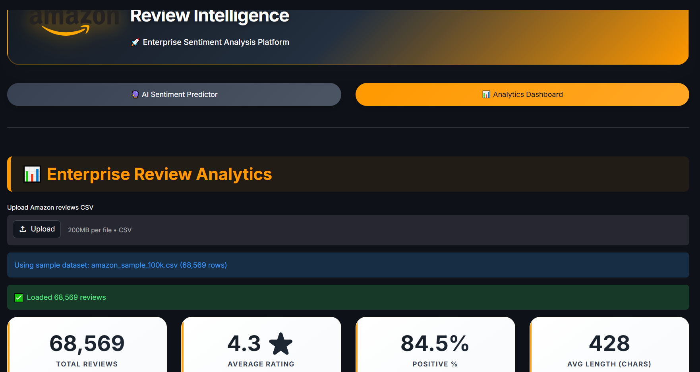

🛒 Amazon Review Intelligence

Enterprise Sentiment Analysis Platform powered by Fine-Tuned DistilBERT

AI-powered web application for real-time Amazon review sentiment analysis using a fine-tuned DistilBERT Transformer model with an interactive Streamlit dashboard.

📌 Overview

Amazon Review Intelligence is an end-to-end NLP application that automatically analyzes Amazon customer reviews and predicts whether the review is Positive or Negative.

The platform combines Deep Learning, Natural Language Processing, and interactive analytics to help understand customer feedback at scale.

✨ Features
🔮 AI Sentiment Prediction
Fine-tuned DistilBERT model
Real-time prediction
Positive & Negative probabilities
Confidence score
Instant inference
📊 Interactive Analytics Dashboard
Total Reviews
Average Rating
Positive Review Percentage
Average Review Length
Star Rating Distribution
Sentiment Distribution
Review Length Analysis
Most Frequent Words
Word Clouds
Monthly Review Trends
🚀 Demo
Positive Sentiment Prediction

  

Negative Sentiment Prediction

  

Analytics Dashboard

 

🧠 Model Architecture
Customer Review
       │
       ▼
DistilBERT Tokenizer
       │
       ▼
Fine-Tuned DistilBERT
       │
       ▼
Softmax Layer
       │
       ▼
Positive / Negative
🎯 Model Performance
Metric	Value
Accuracy	95%+
Framework	Hugging Face Transformers
Backbone	DistilBERT
Task	Binary Sentiment Classification
🤗 Hugging Face Model

The trained model is hosted on Hugging Face.

Repository

FatmaEissa1/amazon-review-sentiment-distilbert

The application downloads the model automatically during deployment.

🏗️ Project Structure
Amazon-Review-Sentiment-Analysis
│
├── app.py
├── requirements.txt
├── README.md
│
├── data/
│   ├── amazon_sample_100k.csv
│   └── absa_dashboard_data.csv
│
├── images/
│   ├── positive_prediction.png
│   ├── negative_prediction.png
│   ├── dashboard.png
│   └── analytics.png
│
└── notebooks/
    └── amazon-product-reviews.ipynb
🛠️ Tech Stack
Programming
Python
Deep Learning
PyTorch
Transformers
DistilBERT
Hugging Face
Data Processing
Pandas
NumPy
Scikit-learn
Visualization
Plotly
Matplotlib
WordCloud
Deployment
Streamlit
Hugging Face Hub
⚙️ Installation

Clone the repository

git clone https://github.com/FatmaEissa/Amazon-Review-Sentiment-Analysis.git

Enter the project

cd Amazon-Review-Sentiment-Analysis

Create a virtual environment

python -m venv venv

Activate the environment

Windows

venv\Scripts\activate

Install dependencies

pip install -r requirements.txt
▶️ Run Locally
streamlit run app.py
💡 Business Applications
Customer feedback analysis
Product review monitoring
Customer satisfaction measurement
Complaint detection
Product quality improvement
Business intelligence
Decision support
👩‍💻 Author
Fatma Eissa

AI Engineer • Machine Learning • NLP • Computer Vision

GitHub

https://github.com/FatmaEissa

Hugging Face

https://huggingface.co/FatmaEissa1

⭐ Support

If you found this project useful, please consider giving it a Star ⭐ on GitHub.