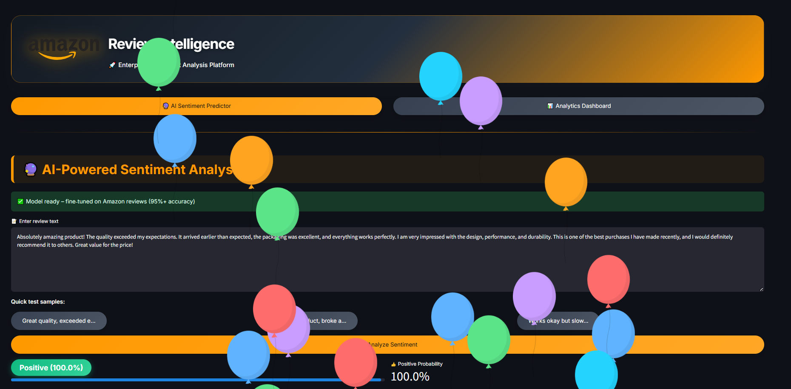
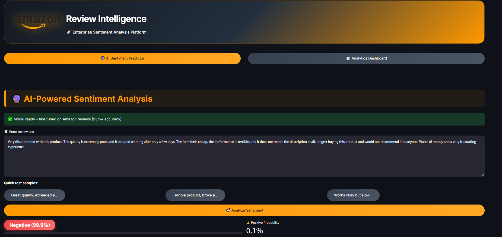
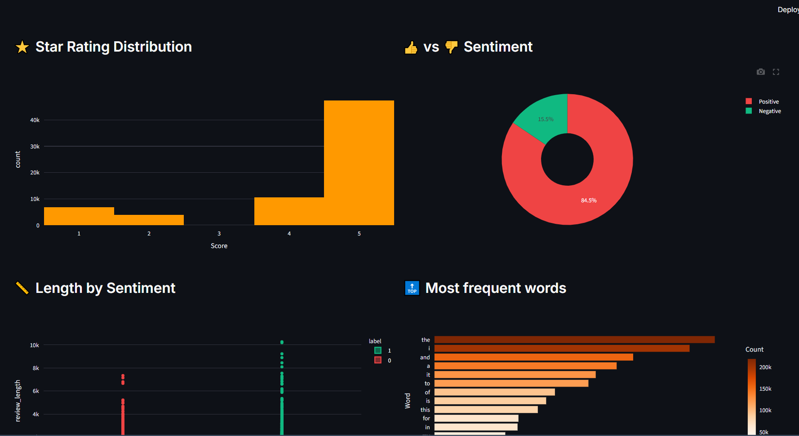

# 🛒 Amazon Review Intelligence Platform

<p align="center">

### 🚀 Enterprise Sentiment Analysis Platform powered by Fine-Tuned DistilBERT

AI-powered web application for analyzing Amazon customer reviews using **Natural Language Processing (NLP)** and **Deep Learning**.

[](https://amazon-review-sentiment-analysis-5ckmms9nycxxjtpfwlksct.streamlit.app/)
[](https://huggingface.co/FatmaEissa1/amazon-review-sentiment-distilbert)
[]
[]
[]

</p>

---

# 📸 Application Preview

<p align="center">

</p>

---

# 🌟 Overview

Amazon Review Intelligence Platform is an enterprise-grade sentiment analysis system that automatically classifies Amazon product reviews into:

- ✅ Positive Reviews
- ❌ Negative Reviews

The application is powered by a **fine-tuned DistilBERT Transformer model** deployed with **Streamlit** and integrated with **Hugging Face Hub** for seamless cloud deployment.

---

# 🚀 Live Demo

### 🌐 Streamlit App

https://amazon-review-sentiment-analysis-5ckmms9nycxxjtpfwlksct.streamlit.app/

---

# 🤗 Hugging Face Model

https://huggingface.co/FatmaEissa1/amazon-review-sentiment-distilbert

---

# ✨ Features

## 🔮 AI Sentiment Prediction

- Real-time sentiment prediction
- Positive / Negative classification
- Confidence score
- Positive probability
- Negative probability
- Fast inference using DistilBERT

---

## 📊 Enterprise Analytics Dashboard

Interactive dashboard including:

- ⭐ Rating Distribution
- 👍 Sentiment Distribution
- 📏 Review Length Analysis
- 🔝 Most Frequent Words
- ☁️ Word Clouds
- 📅 Monthly Review Trends
- KPI Cards

---

# 📷 Analytics Dashboard

<p align="center">

</p>

---

# 📷 Enterprise Dashboard

<p align="center">

</p>

---

# 🧠 Model Architecture

```
Amazon Review
      │
      ▼
Tokenizer
      │
      ▼
Fine-Tuned DistilBERT
      │
      ▼
Softmax Layer
      │
      ▼
Positive / Negative
```

---

# ⚙️ Tech Stack

### Programming

- Python

### Machine Learning

- PyTorch
- Hugging Face Transformers
- DistilBERT
- Scikit-Learn

### Data Analysis

- Pandas
- NumPy

### Visualization

- Plotly
- Matplotlib
- WordCloud

### Deployment

- Streamlit Cloud
- Hugging Face Hub

---

# 📁 Project Structure

```
Amazon-Review-Sentiment-Analysis
│
├── app.py
├── requirements.txt
├── README.md
│
├── data
│   ├── amazon_sample_100k.csv
│   └── absa_dashboard_data.csv
│
├── images
│   ├── positive_prediction.png
│   ├── analytics.png
│   └── dashboard.png
│
└── notebooks
    └── amazon-product-reviews.ipynb
```

---

# 🚀 Installation

```bash
git clone https://github.com/FatmaEissa/Amazon-Review-Sentiment-Analysis.git

cd Amazon-Review-Sentiment-Analysis

python -m venv venv

venv\Scripts\activate

pip install -r requirements.txt

streamlit run app.py
```

---

# 💼 Business Applications

- Customer Satisfaction Analysis
- Product Review Intelligence
- Customer Feedback Mining
- Product Quality Monitoring
- Decision Support System
- Market Sentiment Analysis

---

# 👩‍💻 Author

## Fatma Eissa

AI Engineer • Machine Learning • NLP • Computer Vision

GitHub

https://github.com/FatmaEissa

Hugging Face

https://huggingface.co/FatmaEissa1

---

# ⭐ Support

If you found this project useful, please consider giving it a ⭐ on GitHub.
